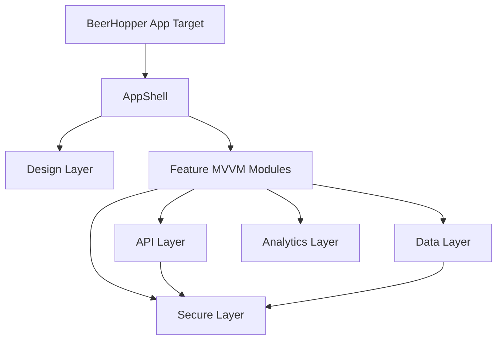
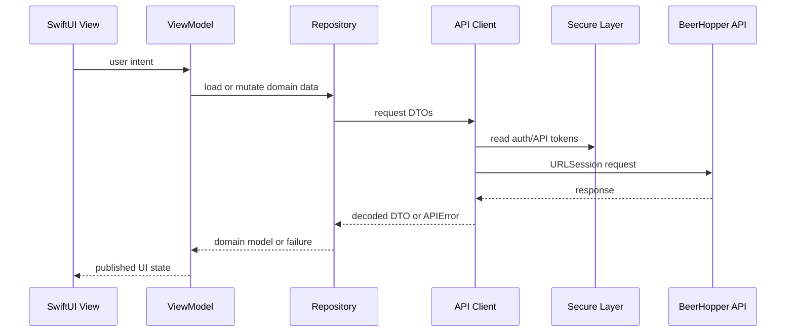
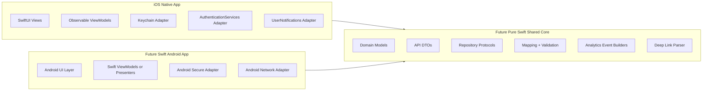
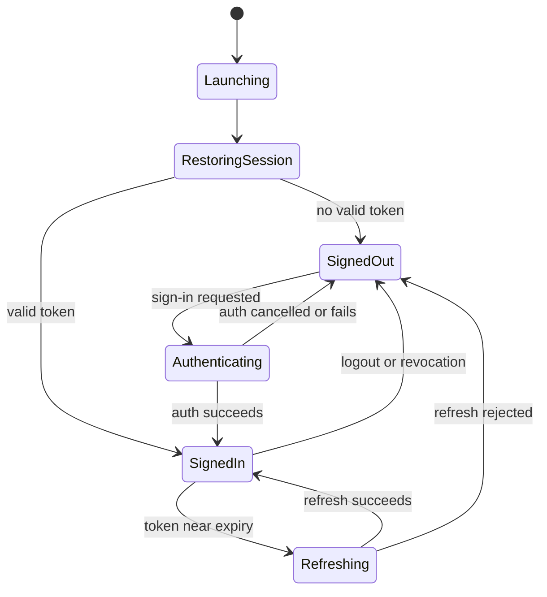
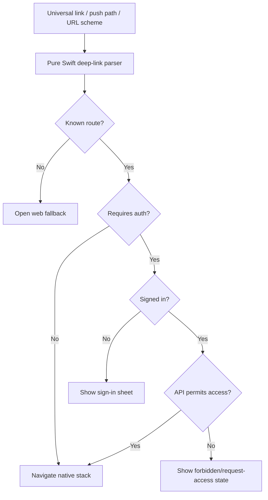

# BeerHopper iOS Architecture Plan

## Current Baseline

The existing repo already contains:

- `BeerHopper`: SwiftUI app target.
- `DesignSystem`: Swift package with early color helpers.
- `NetworkingAPI`: Swift package with REST client, auth providers, search, forum, and ingredient APIs.
- XCTest suites for auth, forum, ingredients, search, and UI launch tests.

The project is stale enough that the implementation should restart inside this existing repository. Existing code should be treated as reference material, not as the foundation to preserve by default.

Restart approach:

- Create a new SwiftUI app structure on the planning-approved branch.
- Keep old code reachable through Git history.
- Rebuild the app shell, API layer, data layer, secure storage layer, design system, and feature modules from first principles.
- Port only reviewed assets, DTOs, tests, and endpoint knowledge that still match the current web/API product.
- Remove hardcoded sample login behavior and any view-to-network coupling during the reset.

## Native-Only Dependency Policy

No external libraries are allowed.

Allowed foundation:

- SwiftUI
- Foundation
- URLSession
- Observation and Combine where useful
- Security framework / Keychain APIs
- CryptoKit where needed for first-party cryptographic helpers
- AuthenticationServices for passkeys and web auth sessions
- LocalAuthentication for Face ID / Touch ID gates where appropriate
- UserNotifications
- SwiftData or Core Data only after a persistence decision is approved
- XCTest and XCUITest

Not allowed:

- Third-party networking clients
- Third-party dependency injection frameworks
- Third-party architecture/state-management frameworks
- Third-party image loaders/caches
- Third-party analytics SDKs unless a future policy exception is explicitly approved
- Third-party realtime/socket clients unless the API contract makes a native implementation impractical and an exception is approved

## Target Module Map



Recommended native layers:

- `AppShell`: app entry point, tab structure, root routing, dependency assembly, scene lifecycle.
- `Design`: semantic tokens, SwiftUI components, async states, entity rows, metric tiles, accessibility helpers.
- `API`: URLSession client, request builders, response decoding, endpoint clients, API error taxonomy.
- `Data`: repositories, caches, domain mappers, pagination, stale-state handling, offline read policies.
- `Secure`: Keychain wrapper, token vault, biometric gates, secret redaction helpers.
- `Analytics`: first-party event contract, consent gate, API analytics mirroring.
- `Realtime`: native realtime transport layer when needed, reconnection policy, brew-session patch application.
- `Features`: MVVM feature modules such as Explore, Search, Brew, Community, Profile, Brewery, Recipe.

These layers may be separate Swift packages or separate source groups at first. The rule is ownership and boundaries, not package count. No layer may depend on third-party code.

## MVVM Request Flow



## Swift Portability Goal

The eventual goal is to use Swift for Android as well. The iOS app should stay fully native and SwiftUI-based, but its non-UI core should be written with future Swift-for-Android reuse in mind.

Portability rules:

- Keep domain models, DTOs, endpoint clients, repositories, validators, pagination, API errors, analytics event builders, and feature flags in pure Swift where practical.
- Isolate Apple-only APIs behind protocols in the app, secure, storage, notification, and realtime layers.
- Keep SwiftUI views, navigation, haptics, Dynamic Type, Keychain, AuthenticationServices, UserNotifications, SwiftData/Core Data, and other Apple-specific implementation details outside the shared core.
- Do not add cross-platform frameworks or external libraries to chase portability.
- Make Android reuse a boundary decision now, not a reason to compromise the iOS-native experience.

Candidate shared core:

- API request/response DTOs.
- Domain models.
- Repository protocols and pure mapping logic.
- Validation and formatting rules.
- Analytics event names and safe parameter builders.
- Deep-link path parsing independent of Apple navigation.

iOS-only implementation:

- SwiftUI views and view modifiers.
- App shell, tabs, navigation stacks, sheets, and toolbars.
- Keychain adapter.
- Local notification adapter.
- Passkey/auth session adapter.
- Device cache implementation.
- Haptics and accessibility modifiers.



## App Shell

The app target should own composition only:

- App lifecycle.
- Root dependency assembly.
- Tab shell and top-level routing.
- Scene handling.
- Universal links and URL schemes.
- Push notification registration.
- App-wide error surfaces.

The app target should not contain API parsing, auth token storage, business rules, or feature-specific view models.

## State Management

Use MVVM with an observable view model per screen or cohesive flow and a small global app model:

- `SessionStore`: auth state, user identity, token status, consent state.
- `FeatureFlagStore`: local defaults plus server capability checks.
- `Router`: tab selection, navigation paths, deep-link handling.
- Feature view models: `@MainActor` observable types for screen state and actions.

Default pattern:

```swift
@MainActor
final class SearchViewModel: ObservableObject {
    @Published private(set) var state: Loadable<SearchResults> = .idle

    private let searchClient: SearchClientProtocol

    init(searchClient: SearchClientProtocol) {
        self.searchClient = searchClient
    }

    func search(_ query: String) async {
        state = .loading
        do {
            state = .loaded(try await searchClient.search(query))
        } catch {
            state = .failed(error)
        }
    }
}
```

Rules:

- Views send user intent to view models.
- View models call protocols, not concrete clients.
- API DTOs are mapped to domain models before rendering where API shape is unstable or server-specific.
- UI state is explicit: idle, loading, loaded, empty, failed, stale.
- Views do not construct requests, read Keychain values, parse JSON, or mutate caches directly.
- Repositories own data orchestration and hide API/cache decisions from view models.

## Networking

The API layer should provide:

- Typed endpoint clients by domain.
- A first-party `RESTClient` built on `URLSession`.
- Request composition for API token, JWT, retry policy, tracing, and consent-safe analytics metadata.
- Error taxonomy: unauthorized, forbidden, not found, validation, rate limited, maintenance, network, decoding, unknown.
- Pagination model shared across search, feeds, posts, beers, recipes, and breweries.
- Request cancellation and task priority support.
- Decoding configured with BeerHopper date formats and safe fallback behavior where the API returns partial arrays.

Security:

- JWT and refresh credentials live in Keychain.
- API tokens come from build configuration, not source.
- No local logging of raw tokens, emails, passwords, passkey challenge payloads, or full free-form user content.

## Data Layer

The data layer should provide:

- Repository protocols and concrete repositories per domain.
- Domain models that are stable for UI use.
- DTO-to-domain mapping.
- Read-through cache policies for public content and active brew-session context.
- Stale state and refresh state.
- Pagination cursors and deduplication.
- Mutation result handling and server-authoritative reconciliation.

Persistence choices:

- Start with in-memory repositories and small disk caches where needed.
- Use `UserDefaults` only for harmless preferences.
- Use Keychain only for secrets.
- Use SwiftData or Core Data only after the domain, migration, and privacy behavior are specified.

## Secure Layer

The secure layer should provide:

- Keychain token storage.
- Token read/write/delete APIs.
- Secret redaction for logs.
- Optional biometric unlock gates for sensitive screens.
- Secure session reset on logout, account deletion, or token revocation.

Rules:

- No JWTs, refresh tokens, passwords, OAuth secrets, or API keys in `UserDefaults`.
- No secrets in crash logs, analytics, push payloads, or debug descriptions.
- Logout clears secure tokens and invalidates private caches.

## Authentication

Target auth model:

- Passkey-first when API support is ready.
- Email/password and Google sign-in as supported providers.
- Session restore on launch through Keychain-backed tokens.
- Explicit signed-out public mode.
- Auth refresh should be centralized and transparent to feature clients.

Immediate hardening from current baseline:

- Remove any sample/hardcoded login from app startup before feature implementation.
- Move provider setup into dependency assembly.
- Add explicit unauthenticated root state and sign-in prompts.



## Deep Links

Map web routes to native destinations:

| Web path | Native destination |
| --- | --- |
| `/explore` | Explore tab |
| `/search?q=` | Search tab with query |
| `/forums` | Community tab |
| `/forums/:postId` | Forum post detail |
| `/breweries`, `/:state/:city/:slug`, `/brewery/:id` | Brewery list/detail |
| `/beer/:id` | Beer detail |
| `/recipes`, `/recipes/:id` | Recipe list/detail |
| `/brew-sessions`, `/brew-sessions/:id` | Brew tab/session detail |
| `/inbox` | Community or Profile inbox destination |
| `/profile`, `/settings`, `/security` | Profile tab destination |

Rules:

- Unknown links open web fallback in `SFSafariViewController` or Safari.
- Private or forbidden links show a native permission state, not a crash or blank screen.
- Push payloads carry a safe path, not sensitive data.



## Realtime and Offline

Brew sessions need realtime-first behavior with REST fallback:

- Socket connection scoped to authenticated sessions.
- Subscribe to active brew session room only while needed.
- Apply server-authoritative patches to local state.
- Mark optimistic local mutations until acknowledged.
- Reconnect with backoff and explicit stale status.

Offline policy:

- MVP: read-through cache for recent search, ingredient detail, forums, and active brew session.
- Brew-day phase 2: queue safe low-risk mutations such as local notes or readings only when conflict behavior is defined.
- Never cache private data into shared app group containers unless explicitly needed and encrypted.

## Analytics

iOS should use the same canonical event names as web:

- `domain.action` for product events.
- `cta.*` only where click attribution maps cleanly to native taps.
- Common envelope: `event_name`, `event_source=ios`, `event_ts`, `event_path`, `analytics_schema`.

Rules:

- Respect analytics consent before sending.
- Mirror eligible events to the API analytics endpoint when server forwarding remains the source of truth.
- Implement analytics with first-party API calls and Apple-native plumbing only.
- Do not send secrets, tokens, email addresses, raw text input, or precise location unless a future explicit consent model covers it.
- UTM/deep-link attribution should be captured from universal links and install/referral contexts where available.

## Testing Strategy

Unit:

- Domain model mapping.
- Endpoint request construction.
- Auth/session state.
- Feature view models.
- Design token stability where applicable.

Integration:

- Mock API server responses.
- Auth restore and refresh.
- Deep-link route resolution.
- Realtime patch application.

UI:

- Launch signed out.
- Search flow.
- Forum read flow.
- Brew session detail read flow.
- Settings/privacy flow.

## Build Configuration

Use explicit configurations:

- Debug Local
- Debug Staging
- Release Staging
- Release Production

Configuration should include:

- API base URL.
- API token reference.
- OAuth client IDs.
- Analytics enabled flag.
- Feature flag defaults.
- Universal link domains.

Do not put production secrets in source.
