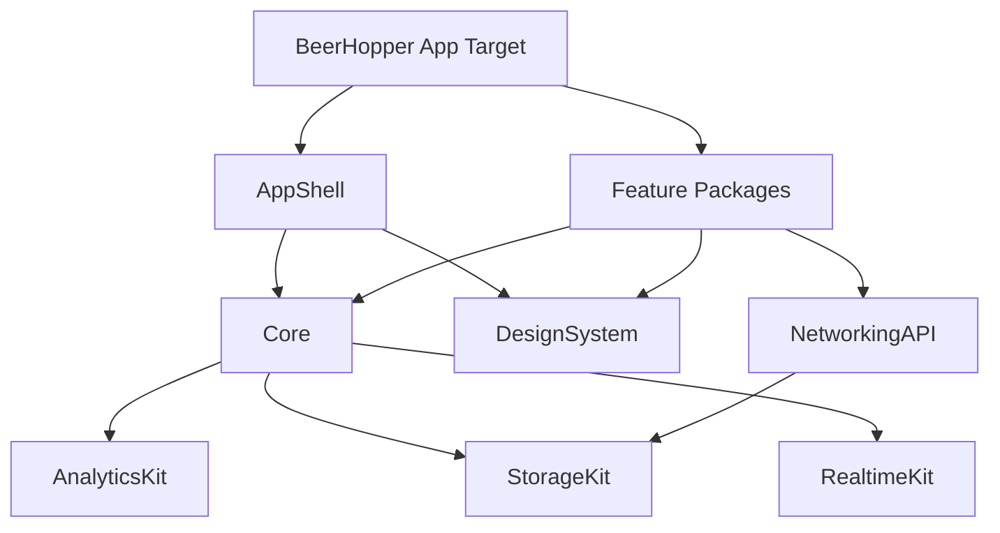

# BeerHopper iOS Architecture Plan

## Current Baseline

The existing repo already contains:

- `BeerHopper`: SwiftUI app target.
- `DesignSystem`: Swift package with early color helpers.
- `NetworkingAPI`: Swift package with REST client, auth providers, search, forum, and ingredient APIs.
- XCTest suites for auth, forum, ingredients, search, and UI launch tests.

This plan keeps that package direction and hardens it into a scalable native architecture.

## Target Module Map



Recommended packages:

- `Core`: environment, app state, feature flags, logging, clocks, IDs, errors, capability models.
- `DesignSystem`: tokens, reusable controls, async state views, image views, entity rows, metrics.
- `NetworkingAPI`: generated or hand-maintained endpoint clients, DTOs, auth headers, API errors.
- `StorageKit`: Keychain, caches, user defaults wrappers, persistence policies.
- `AnalyticsKit`: event contract, consent gate, GA/Firebase/server forwarding adapter.
- `RealtimeKit`: socket client, presence, brew-session patches, reconnection policy.
- Feature packages over time: `ExploreFeature`, `SearchFeature`, `BrewFeature`, `CommunityFeature`, `ProfileFeature`, `BreweryFeature`, `RecipeFeature`.

## App Shell

The app target should own composition only:

- App lifecycle.
- Root dependency assembly.
- Tab shell and top-level routing.
- Scene handling.
- Universal links and URL schemes.
- Push notification registration.
- App-wide error surfaces.

The app target should not contain API parsing, auth token storage, business rules, or feature-specific view models.

## State Management

Use an observable model per feature and a small global app model:

- `SessionStore`: auth state, user identity, token status, consent state.
- `FeatureFlagStore`: local defaults plus server capability checks.
- `Router`: tab selection, navigation paths, deep-link handling.
- Feature view models: `@MainActor` observable types for screen state and actions.

Default pattern:

```swift
@MainActor
final class SearchViewModel: ObservableObject {
    @Published private(set) var state: Loadable<SearchResults> = .idle

    private let searchClient: SearchClientProtocol

    init(searchClient: SearchClientProtocol) {
        self.searchClient = searchClient
    }

    func search(_ query: String) async {
        state = .loading
        do {
            state = .loaded(try await searchClient.search(query))
        } catch {
            state = .failed(error)
        }
    }
}
```

Rules:

- Views send user intent to view models.
- View models call protocols, not concrete clients.
- API DTOs are mapped to domain models before rendering where API shape is unstable or server-specific.
- UI state is explicit: idle, loading, loaded, empty, failed, stale.

## Networking

`NetworkingAPI` should provide:

- Typed endpoint clients by domain.
- `RESTClient` with request middleware for API token, JWT, retry, tracing, and consent-safe analytics metadata.
- Error taxonomy: unauthorized, forbidden, not found, validation, rate limited, maintenance, network, decoding, unknown.
- Pagination model shared across search, feeds, posts, beers, recipes, and breweries.
- Request cancellation and task priority support.

Security:

- JWT and refresh credentials live in Keychain.
- API tokens come from build configuration, not source.
- No local logging of raw tokens, emails, passwords, passkey challenge payloads, or full free-form user content.

## Authentication

Target auth model:

- Passkey-first when API support is ready.
- Email/password and Google sign-in as supported providers.
- Session restore on launch through Keychain-backed tokens.
- Explicit signed-out public mode.
- Auth refresh should be centralized and transparent to feature clients.

Immediate hardening from current baseline:

- Remove any sample/hardcoded login from app startup before feature implementation.
- Move provider setup into dependency assembly.
- Add explicit unauthenticated root state and sign-in prompts.

## Deep Links

Map web routes to native destinations:

| Web path | Native destination |
| --- | --- |
| `/explore` | Explore tab |
| `/search?q=` | Search tab with query |
| `/forums` | Community tab |
| `/forums/:postId` | Forum post detail |
| `/breweries`, `/:state/:city/:slug`, `/brewery/:id` | Brewery list/detail |
| `/beer/:id` | Beer detail |
| `/recipes`, `/recipes/:id` | Recipe list/detail |
| `/brew-sessions`, `/brew-sessions/:id` | Brew tab/session detail |
| `/inbox` | Community or Profile inbox destination |
| `/profile`, `/settings`, `/security` | Profile tab destination |

Rules:

- Unknown links open web fallback in `SFSafariViewController` or Safari.
- Private or forbidden links show a native permission state, not a crash or blank screen.
- Push payloads carry a safe path, not sensitive data.

## Realtime and Offline

Brew sessions need realtime-first behavior with REST fallback:

- Socket connection scoped to authenticated sessions.
- Subscribe to active brew session room only while needed.
- Apply server-authoritative patches to local state.
- Mark optimistic local mutations until acknowledged.
- Reconnect with backoff and explicit stale status.

Offline policy:

- MVP: read-through cache for recent search, ingredient detail, forums, and active brew session.
- Brew-day phase 2: queue safe low-risk mutations such as local notes or readings only when conflict behavior is defined.
- Never cache private data into shared app group containers unless explicitly needed and encrypted.

## Analytics

iOS should use the same canonical event names as web:

- `domain.action` for product events.
- `cta.*` only where click attribution maps cleanly to native taps.
- Common envelope: `event_name`, `event_source=ios`, `event_ts`, `event_path`, `analytics_schema`.

Rules:

- Respect analytics consent before sending.
- Mirror eligible events to the API analytics endpoint when server forwarding remains the source of truth.
- Do not send secrets, tokens, email addresses, raw text input, or precise location unless a future explicit consent model covers it.
- UTM/deep-link attribution should be captured from universal links and install/referral contexts where available.

## Testing Strategy

Unit:

- Domain model mapping.
- Endpoint request construction.
- Auth/session state.
- Feature view models.
- Design token stability where applicable.

Integration:

- Mock API server responses.
- Auth restore and refresh.
- Deep-link route resolution.
- Realtime patch application.

UI:

- Launch signed out.
- Search flow.
- Forum read flow.
- Brew session detail read flow.
- Settings/privacy flow.

## Build Configuration

Use explicit configurations:

- Debug Local
- Debug Staging
- Release Staging
- Release Production

Configuration should include:

- API base URL.
- API token reference.
- OAuth client IDs.
- Analytics enabled flag.
- Feature flag defaults.
- Universal link domains.

Do not put production secrets in source.
