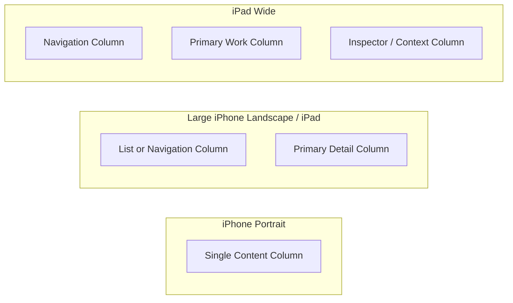

# BeerHopper iOS Design Language

## Platform Baseline

BeerHopper iOS targets iOS 26+ as the design baseline. The app must be Liquid Glass compatible while still feeling operational, calm, and scan-friendly for brewing workflows.

Liquid Glass compatibility means:

- Use system materials and native container behavior before custom translucent effects.
- Let toolbars, tab bars, sheets, menus, and navigation surfaces inherit iOS 26 platform treatment where possible.
- Keep content legible over translucent or layered surfaces in light, dark, high contrast, and accessibility text sizes.
- Avoid stacking decorative blur/glass effects on top of dense brewing data.
- Use depth to clarify navigation hierarchy, not as decoration.
- Keep critical brew-day controls, timers, readings, and warnings on stable, high-contrast surfaces.
- Test both bright content imagery and dark beer/brewery imagery behind translucent surfaces.
- Provide fallback solid surfaces where Liquid Glass treatment reduces readability or accessibility.

## Design Goal

BeerHopper iOS should feel like an Apple app with BeerHopper character. The app should borrow the web brand palette, domain hierarchy, and information density, while using native SwiftUI structure, system typography, SF Symbols, platform motion, and platform accessibility.

## Brand Translation

Web design traits:

- Calm operational surfaces.
- Light and dark themes.
- Navy/slate text and surfaces.
- Blue primary action color.
- Amber beer accent.
- Green success/freshness accent.
- Scan-friendly dashboard cards and lists.

iOS translation:

- Use `NavigationStack`, `TabView`, `List`, `Form`, `Section`, `Searchable`, `ToolbarItem`, `Menu`, `ConfirmationDialog`, and `.sheet`.
- Prefer system Liquid Glass-compatible navigation, tab, toolbar, sheet, menu, and material behaviors over custom chrome.
- Use cards sparingly. Prefer native grouped lists and section backgrounds for repeated mobile workflows.
- Use large titles only for top-level tabs. Detail screens should use inline titles when content density matters.
- Use SF Symbols before custom icons. Use BeerHopper brand assets for app icon, empty states, and selected brand moments.
- Avoid web-style sidebars on iPhone. Use tabs, search, segmented controls, and sheets.

## Token Direction

Initial semantic tokens should live in the `DesignSystem` package.

### Colors

| Token | Light | Dark | Purpose |
| --- | --- | --- | --- |
| `bh.background` | `#F8FAFC` | `#0B1220` | App background |
| `bh.surface` | `#FFFFFF` | `#0F172A` | Cards, grouped content, sheets |
| `bh.textPrimary` | `#0F172A` | `#E2E8F0` | Primary text |
| `bh.textSecondary` | `#475569` | `#94A3B8` | Secondary text |
| `bh.border` | `#E2E8F0` | `#1E293B` | Separators and outlines |
| `bh.action` | `#2563EB` | `#93C5FD` | Primary actions and selected state |
| `bh.success` | `#16A34A` | `#4ADE80` | Success, complete, fresh |
| `bh.warning` | `#F59E0B` | `#FBBF24` | Warnings, beer/amber accent |
| `bh.info` | `#0284C7` | `#38BDF8` | Informational callouts |

Rules:

- Expose colors as semantic SwiftUI values, not raw hex calls in feature views.
- Respect system light/dark and high-contrast variants.
- Define surface tokens that can resolve to Liquid Glass materials or solid fallback colors depending on context and accessibility.
- Do not overuse amber. Use it for beer-domain accents, warnings, ratings, and brand highlights.
- Do not create a one-note blue or amber app. Let content photography, beer styles, ingredient colors, and system surfaces carry variety.

### Typography

Use Dynamic Type and Apple text styles:

- Top-level title: `.largeTitle.weight(.bold)` only at tab roots.
- Screen title: `.title2.weight(.semibold)` or navigation title.
- Section heading: `.headline`.
- Body: `.body`.
- Dense metadata: `.subheadline` and `.caption`.
- Monospaced digits for timers, gravity, temperature, pH, ABV, IBU, and quantity readouts.

Rules:

- Do not hardcode font sizes unless building a reusable token that still scales.
- Existing Roboto assets should not be the default UI font. Keep the app native with SF Pro unless a brand moment requires a custom face.

### Spacing and Shape

- Base spacing scale: 4, 8, 12, 16, 20, 24, 32.
- Compact content radius: 8.
- Card/group radius: follow native grouped list, material, and Liquid Glass container defaults where possible.
- Touch targets: minimum 44x44 points.
- Dense rows should preserve scanability with consistent leading icons and trailing metadata.

### Columnar Layout

BeerHopper iOS should use a columnar layout system where the platform and content warrant it.

Rules:

- iPhone portrait defaults to one primary column.
- Large iPhone landscape can use two columns for summary/detail, metric panels, or filter/result layouts when it improves scanning.
- iPad and wider contexts should use two or three columns for dashboards, search results plus detail, brew-day summary plus active step, and brewery management.
- Columns should be semantic, not decorative: navigation/list, primary content, inspector/context.
- Column widths should follow content priority and Dynamic Type. Critical labels, metrics, timers, and buttons must not compress below usable sizes.
- Liquid Glass sidebars/toolbars can frame columns, but dense column content should keep stable, legible surfaces.
- Avoid nested card grids inside cards. Prefer native split/column structure, grouped lists, sections, and inspector panels.

### Liquid Glass Surface Rules

- Top-level tabs and navigation bars should use native system treatment.
- Detail toolbars can use translucent/material treatment when surrounding content remains readable.
- Dense operational panels should default to stable grouped backgrounds.
- Modal sheets should use platform sheet materials and avoid custom full-screen overlays unless the workflow requires it.
- Entity hero imagery may sit behind native material overlays only when text contrast is guaranteed.
- Brew-day active controls should not float on low-contrast glass surfaces.
- Destructive actions, warnings, and permission prompts need solid contrast and clear iconography.

## Component Direction

Reusable components should be designed as SwiftUI primitives:

- `BHStatusBadge`: compact status, plan, role, permission, and session phase badges.
- `BHMetricTile`: gravity, ABV, IBU, SRM, temperature, pH, timer, and count values.
- `BHAsyncContent`: loading, empty, error, stale, and retry states.
- `BHRemoteImage`: image loading with placeholder, cache, and safe fallback.
- `BHEntityRow`: reusable row for brewery, beer, recipe, person, ingredient, and forum post previews.
- `BHActionFooter`: sticky bottom action area for forms and brew-day steps.
- `BHPermissionGate`: renders allowed, read-only, or upgrade/claim prompts from API capability state.

## Screen Patterns

### Explore

- Top-level `NavigationStack` with `.searchable`.
- Feed cards as native rounded groups with clear source, timestamp, and primary action.
- Infinite scroll with explicit loading row and retry state.

### Search

- Search suggestions before query.
- Segmented scope picker for All, Breweries, Beers, Recipes, Ingredients, Posts, People.
- Results use entity rows, not separate card styles per domain.

### Brew

- Active brew session at the top.
- Phase list with progress, timers, warnings, and next action.
- Sticky timer/action affordance for active steps.
- Measurements use monospaced numeric rows and clear units.

### Community

- Forum list with category filters and unread/follow indicators.
- Post detail as a native threaded discussion view.
- Compose via sheet with autosave draft and attachment affordance later.

### Profile

- Settings as grouped form sections.
- Privacy and security flows use native confirmations and explicit status rows.

## Accessibility

- VoiceOver labels must include entity type and status, not just name.
- Dynamic Type must not truncate critical brewing values or action labels.
- Color cannot be the only status indicator.
- Support reduce motion by avoiding nonessential animation.
- Liquid Glass/material surfaces must pass contrast checks or switch to solid fallback treatment.
- Haptics should confirm successful state changes and warn on destructive actions, but never replace visible feedback.
