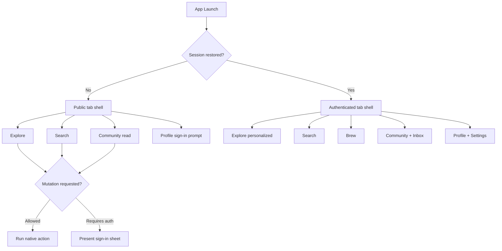

# BeerHopper iOS Product Plan

## Objective

Build an iOS 26+ SwiftUI BeerHopper app that pairs with the website and API while delivering a native Apple experience. The iOS app should help users discover beer content, participate in the community, manage brewing work, and run brew-day sessions from a phone.

## Repository Strategy

Use the existing `BeerHopper-iOS` GitHub repository, but restart the app implementation instead of incrementally polishing the stale project.

Restart rules:

- Preserve the current code on the existing branch history for reference.
- Replace the app structure with a clean SwiftUI/MVVM architecture.
- Bring forward only proven API models, endpoint knowledge, or tests after review.
- Do not keep sample login behavior, stale navigation, or ad hoc view/API coupling.
- Treat this planning PR as the approval gate before the reset implementation starts.

## Product Principles

- **Native first:** use Apple platform patterns for navigation, lists, search, forms, sheets, menus, notifications, passkeys, and sharing.
- **iOS 26+ visual baseline:** design and implementation should be compatible with the iOS 26 Liquid Glass system language, including translucent materials, depth, toolbar/tab treatment, and legibility rules.
- **No external libraries:** use SwiftUI, Foundation, URLSession, Observation/Combine as needed, Security/Keychain APIs, SwiftData/Core Data as approved, XCTest, and other Apple frameworks only.
- **SwiftLint enforced style:** use SwiftLint as a development-time quality tool, require explicit `self.`, and avoid singleton patterns.
- **MVVM throughout:** views render state, view models coordinate user intent and async work, models represent domain/API data, and services own IO boundaries.
- **Responsive columnar design:** use native columnar layout patterns for dashboards, search, brew-day, and management screens across compact, regular, and expanded contexts.
- **Future Swift portability:** keep domain models, API clients, data repositories, secure abstractions, and analytics contracts in pure Swift where practical so a future Swift-for-Android client can reuse the non-UI core.
- **Same product, mobile shape:** use the web product model and vocabulary, but optimize the interaction model for one-handed, repeated mobile use.
- **Server-authoritative:** the API owns privacy, permissions, plan limits, claimability, role checks, and mutation validation.
- **Progressive parity:** ship reliable mobile-critical journeys before attempting full web parity.
- **Operational clarity:** brewing screens should be calm, dense, and legible in a kitchen, garage, taproom, or event setting.

## Target Audiences

- Homebrewers running brew sessions, tracking recipes, and managing ingredients.
- Brewery owners and members managing profiles, events, tap lists, equipment, and teams.
- Beer enthusiasts discovering breweries, beers, recipes, and community posts.
- Returning users checking inbox, activity, follows, notifications, and profile status.

## MVP Scope

MVP should cover the mobile journeys where a native app clearly improves usage:

- Authentication and session restore.
- Global search across breweries, beers, recipes, ingredients, posts, and people.
- Explore feed with cards for posts, breweries, beers, recipes, brew sessions, events, and activity.
- Forums read, create, comment, react, and moderation affordances where permitted.
- Ingredient and recipe browsing with recipe detail views.
- Brewery profile read views with public/member mode handling.
- Brew session detail with phase list, timers, notes, readings, and realtime updates.
- Inbox read/unread, deep links, and notification settings.
- Profile, settings, privacy consent, theme preference, and account security entry points.

## Explicit Non-MVP

- Full storefront checkout.
- Full brewery admin suite parity.
- Full recipe editor parity.
- Offline-first mutation queue for every domain.
- Third-party package adoption.
- Android app implementation, even though shared pure-Swift core portability should influence boundaries now.
- Apple Watch, widgets, App Intents, and Live Activities, except as future candidates.
- Native payment flows until plan and App Store policy questions are resolved.

## Navigation Model

Primary tabs:

- **Explore:** personalized activity feed, trending, last viewed, and discovery modules.
- **Search:** global search and browse entry points for breweries, beers, recipes, ingredients, and people.
- **Brew:** active sessions, brew-day detail, timers, readings, notes, and session history.
- **Community:** forums, follows, notifications, and inbox entry points.
- **Profile:** account, settings, billing summary, privacy, security, and owned/member breweries.

Rules:

- Public users see useful read-only tabs and sign-in prompts only at mutation points.
- Authenticated users see personalized modules and member actions.
- Deep links should map from web paths into the closest native screen.
- Navigation stacks should preserve tab state when switching tabs.

## Feature Parity Strategy

### Phase 1: Mobile Core

- Auth/session restore.
- Search and browse.
- Explore feed.
- Forums.
- Ingredient/recipe read views.
- Basic profile/settings.

### Phase 2: Brew-Day Companion

- Brew session list/detail.
- Phase flow, timers, notes, readings, measurements, and collaboration presence.
- Realtime socket integration with REST fallback.
- Offline read cache for active session.

### Phase 3: Brewery Operations

- Brewery profile management.
- Team and permissions views.
- Events, tap list, blog/content, equipment, and image upload workflows.
- Plan-gated controls rendered from API capabilities.

### Phase 4: Native Platform Expansion

- Push notifications.
- Share extension or share sheet integrations.
- Live Activity for active brew timers.
- Widgets for active brew session and inbox counts.
- App Intents for quick search and brew timers.

## Success Metrics

- User can install, authenticate, and resume a session without re-login churn.
- Search and public discovery feel faster than mobile web.
- Brew-day timer/readings flows are usable with one hand.
- Deep links from web, email, push, and share open the correct native context.
- Analytics uses the same event names and safe parameter rules as web.
- App Store review requirements, privacy nutrition labels, and tracking disclosures are known before launch.
