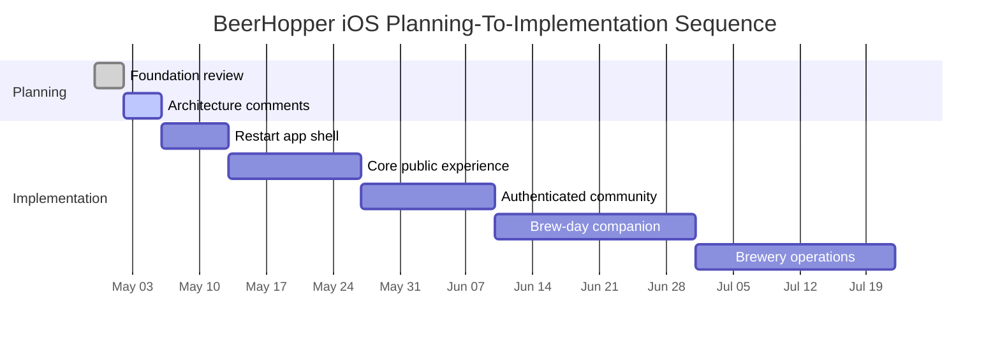

# BeerHopper iOS Roadmap

## Phase 0: Foundation Review

Goal: agree on architecture, design language, and release scope before broad implementation.

Deliverables:

- Planning docs in this folder.
- Restart decision for the existing repo.
- Native-only dependency policy.
- SwiftLint coding standard, including explicit `self.` and singleton avoidance.
- Dependency injection standards for app-wide and feature-level services.
- MVVM module map and layer ownership.
- Swift-for-Android portability boundaries for non-UI core code.
- Design token list and component inventory.
- iOS 26+ Liquid Glass compatibility requirements.
- Deep-link map from web to iOS.
- MVP scope and non-goals.

Acceptance:

- Product owner approves MVP scope.
- Engineering accepts the restart path and native-only policy.
- Engineering accepts MVVM and layer boundaries.
- Engineering accepts SwiftLint as a development-only tool and agrees to explicit `self.` / no-singleton standards.
- Engineering accepts dependency injection as the default for BeerHopper-owned services.
- Engineering accepts which code is pure Swift shared-core candidate versus iOS-only implementation.
- Design direction is approved as native iOS, not a web clone.
- Liquid Glass usage rules are approved for dense brew-day and data-heavy screens.

## Phase 1: App Shell and Design System

Deliverables:

- Fresh SwiftUI app structure in the existing repo.
- App shell with tabs, route coordinator, and dependency assembly.
- SwiftLint configuration with explicit self and singleton-avoidance rules.
- Design system tokens for colors, typography, spacing, shape, shadows, status, and metrics.
- Liquid Glass-compatible surface/material tokens and solid accessibility fallbacks.
- Columnar layout primitives for compact, regular, and expanded contexts.
- Reusable async, row, badge, metric, and remote image components.
- First-party API, data, secure, and analytics layer skeletons.
- Pure Swift shared-core candidate folder or package for domain/API/data contracts.
- Remove hardcoded sample login from startup.
- Build configurations for staging and production.

Acceptance:

- App launches signed out and signed in without sample credentials.
- No third-party dependencies are present.
- SwiftLint runs locally/CI and enforces explicit `self.` where available.
- BeerHopper-owned services are injected, not accessed as singletons.
- Feature previews and tests can replace API/data/secure/analytics dependencies with fakes.
- MVVM boundaries are visible in the first feature skeleton.
- Apple-specific adapters are isolated behind protocols where future Swift-for-Android reuse matters.
- Dynamic Type, dark mode, and high contrast work on shell screens.
- Liquid Glass/material surfaces remain legible on iOS 26+ across light/dark/high-contrast modes.
- Unit tests cover route resolution and session state.

## Phase 2: Core Public Experience

Deliverables:

- Explore feed.
- Global search.
- Public brewery, beer, recipe, ingredient, and forum read views.
- Sign-in prompts at mutation points.
- Analytics consent and baseline event tracking.

Acceptance:

- Anonymous user can browse meaningful content.
- Search and detail routes support universal link mapping.
- API errors render native empty/error states.
- Analytics is consent-gated.

## Phase 3: Authenticated Community

Deliverables:

- Login/register/session restore.
- Forums create/comment/react.
- Inbox read/unread.
- Profile and settings.
- Privacy and security entry points.

Acceptance:

- User can authenticate, leave/reopen app, and restore session.
- Unauthorized/forbidden states are distinct and actionable.
- Forum mutations have optimistic or explicit loading states.

## Phase 4: Brew-Day Companion

Deliverables:

- Brew session list/detail.
- Session phases, timers, notes, readings, and metrics.
- Realtime subscription and REST fallback.
- Offline read cache for active session.
- Conflict and stale-state indicators.

Acceptance:

- Active brew session can be followed from phone without page reload.
- Timer and reading UI remains legible at large Dynamic Type.
- Reconnect and stale-state behavior is visible and recoverable.

## Phase 5: Brewery Operations

Deliverables:

- Brewery member views.
- Claim/manage capability gates.
- Events and tap list read/manage flows.
- Equipment and brewery profile editing.
- Image upload flows.

Acceptance:

- Public/member/admin/owner capability states match API response.
- Private breweries do not leak data through previews or caches.
- Image upload errors are recoverable and understandable.

## Phase 6: Native Platform Enhancements

Deliverables:

- Push notifications.
- Live Activities for brew timers.
- Widgets for active brew sessions and inbox.
- Share sheet support.
- App Intents for quick actions.

Acceptance:

- Push payloads contain safe path references only.
- Live Activities do not expose private session content on lock screen unless user opts in.
- Widgets respect auth, privacy, and stale states.
