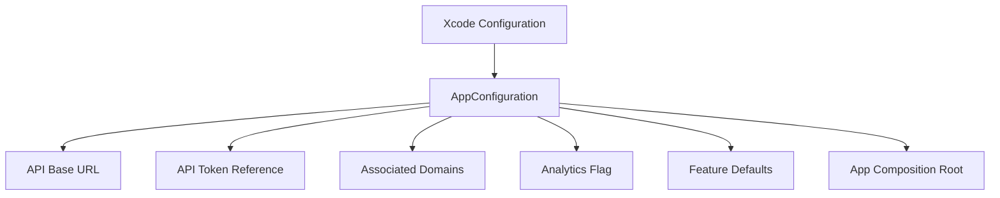

# Build Configuration Plan

## Configurations

| Configuration | Purpose | API |
| --- | --- | --- |
| Debug Local | local development against local or staging services | configurable |
| Debug Staging | simulator/device testing against staging | staging API |
| Release Staging | TestFlight/internal validation before production | staging API |
| Release Production | App Store production build | production API |

## Required Inputs

- API base URL.
- API token reference.
- OAuth/passkey configuration IDs.
- Universal link domains.
- Analytics enabled flag.
- Feature flag defaults.
- Bundle identifier suffix/prefix strategy.
- App display name per environment if needed.

## Secret Handling

- Secrets are not committed.
- Runtime auth tokens live only in Keychain.
- Build-time API tokens should come from local build settings, CI secrets, or Xcode configuration files excluded from Git when they contain sensitive values.
- Sample configuration files may exist only with placeholder values.

## Suggested File Shape

```text
Configurations/
  DebugLocal.xcconfig.example
  DebugStaging.xcconfig.example
  ReleaseStaging.xcconfig.example
  ReleaseProduction.xcconfig.example
```

If checked in, `.xcconfig` files must use placeholders or non-secret defaults only.

## Runtime Environment Model



## Acceptance Checklist

- Each environment is named and documented.
- Secret and non-secret values are separated.
- Implementation can switch environments without source edits.
- CI/TestFlight can build staging and production variants intentionally.
- Production secrets are never committed.
