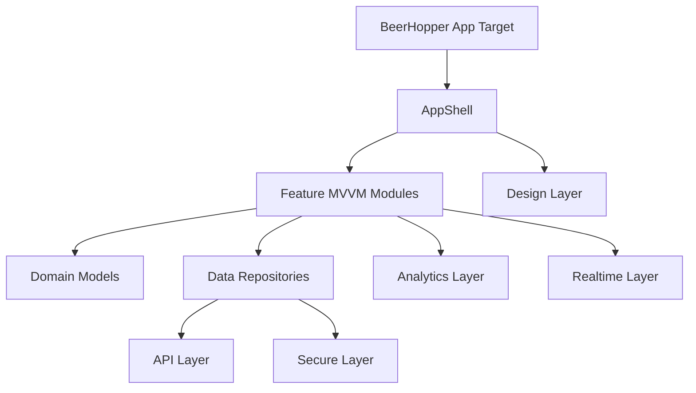

# Ownership Map

## Architecture Shape

BeerHopper iOS uses MVVM with explicit layers. The app should be native SwiftUI, iOS 26+ Liquid Glass compatible, and built without external runtime libraries.

## Layer Ownership

| Layer | Owns | Does Not Own |
| --- | --- | --- |
| `AppShell` | app lifecycle, dependency assembly, root tabs, routing, scene handling | endpoint parsing, business rules, token storage |
| `Design` | tokens, columnar layout primitives, Liquid Glass surfaces, reusable SwiftUI components | feature-specific API calls |
| `Features` | SwiftUI views, view models, screen state, user intents | URLSession requests, Keychain access, JSON parsing |
| `Domain` | stable models, enums, validation and formatting rules | SwiftUI layout, transport details |
| `API` | request builders, URLSession client, DTOs, API errors | UI state, cache policy |
| `Data` | repositories, DTO/domain mapping, pagination, stale state, cache policy | token storage, navigation |
| `Secure` | Keychain adapter, token vault, redaction, secure reset | business workflows |
| `Analytics` | event builders, consent gate, API mirroring | raw PII or secrets |
| `Realtime` | transport protocol, reconnect policy, patch application | feature UI |

## Dependency Direction

- Views depend on view models.
- View models depend on protocols.
- Repositories depend on API/data/secure protocols.
- Concrete dependencies are built in the app composition root.
- Tests and previews inject fakes.
- Feature code does not call BeerHopper-owned `shared`, `default`, service locators, or global registries.

## Dependency Injection

Inject where practical:

- API clients
- repositories
- session stores
- secure storage adapters
- analytics clients
- realtime clients
- feature flag providers
- date/clock providers
- ID providers
- notification adapters
- cache/image adapters

Preferred order:

1. Initializer injection for view models, repositories, services, and adapters.
2. SwiftUI environment values for app-wide dependencies that many views need.
3. Test fakes through protocol conformances.

## Swift Style Ownership

- SwiftLint enforces explicit `self.` where Swift permits it.
- `self.` should appear on instance property and method references.
- BeerHopper-owned singletons are not allowed.
- Apple singleton-style APIs must be wrapped behind injectable adapters before feature code uses them.
