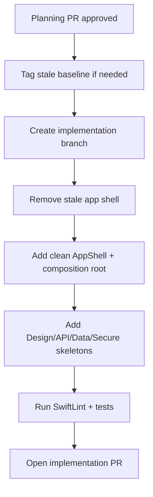

# Reset Strategy

## Decision

Reuse the existing `BeerHopper-iOS` repository, but restart the app implementation. The current app is preserved through Git history and treated as reference material only.

## Branching Plan

1. Keep `main` as the repository default branch.
2. Merge the planning PR after review.
3. Create the implementation branch from updated `main`.
4. Do not rewrite `main` history.
5. If a hard reference point is needed, tag the current stale baseline before removing old implementation files.

Suggested tag:

```bash
git tag ios-stale-baseline-2026-04-29
git push origin ios-stale-baseline-2026-04-29
```

## What Can Be Ported Forward

Port only after review:

- App icon and approved brand assets.
- Endpoint knowledge that still matches the API.
- DTOs that still decode current API responses.
- Tests that describe still-valid contracts.
- Useful design token names if they align with the new design system.

Do not port by default:

- Hardcoded sample login behavior.
- Singleton-style provider access.
- View-to-network coupling.
- Stale navigation shell.
- Ad hoc styling outside design tokens.
- Runtime external dependencies.

## Reset Sequence



## Safety Rules

- Do not delete useful history; use Git history/tags instead of copying stale files into archive folders.
- Do not add secrets, provisioning profiles, or derived data.
- Do not introduce external runtime libraries.
- Keep each reset PR small enough to review.
- Use Jira issue keys in branch names and PR titles.
