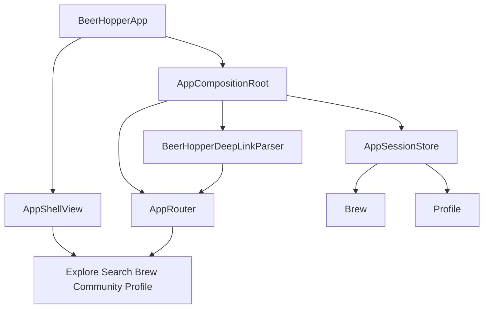
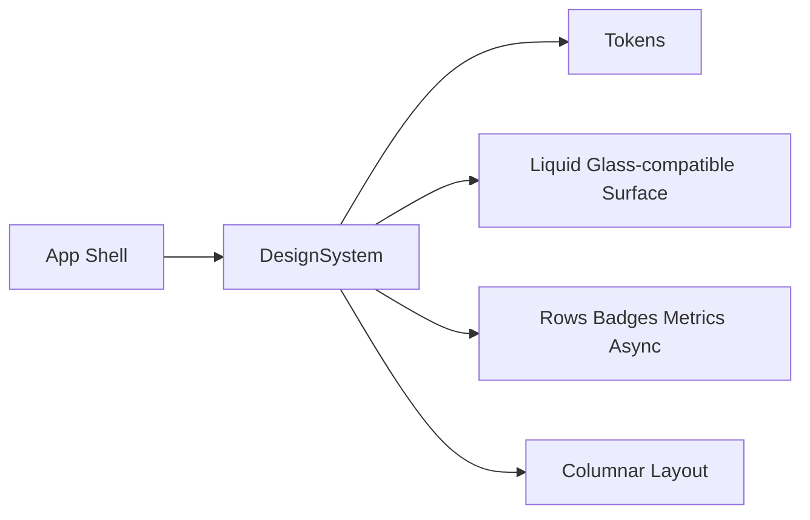

# Sprint 2 - Shell Design

Sprint 2 starts the implementation reset by replacing the stale dashboard entry point with a native SwiftUI shell and design-system primitives.

## Jira Scope

- `MOBILE-28`: Build clean SwiftUI AppShell with tab shell and router
- `MOBILE-29`: Implement BeerHopper design tokens in native SwiftUI
- `MOBILE-30`: Build reusable native async and entity components
- `MOBILE-31`: Implement pure Swift deep-link parser and route model
- `MOBILE-32`: Remove sample login behavior and add signed-out shell state
- `MOBILE-62`: Define iOS 26 Liquid Glass surface system
- `MOBILE-64`: Define responsive columnar layout primitives

## Implementation Notes

- `BeerHopperApp` now owns an injected `AppCompositionRoot`.
- The app opens into `AppShellView`, a native `TabView` with `NavigationStack` roots.
- `AppRouter` owns tab selection and deep-link route context.
- `AppSessionStore` starts signed out and does not perform sample login.
- `BeerHopperDeepLinkParser` accepts `beerhopper.com`, `www.beerhopper.com`, `beerhopper.me`, `www.beerhopper.me`, and the `beerhopper://` scheme.
- `DesignSystem` now includes semantic tokens, Liquid Glass-compatible surface styling, async state rendering, entity rows, metric tiles, badges, and columnar layout primitives.
- The stale app views/components/tests and external `NetworkingAPI` package were removed from the active workspace. API/data work restarts natively in later sprints without third-party runtime libraries.

## Shell Flow



## Design Boundary



## Validation

Run at the end of the sprint branch:

```bash
git diff --check
swiftlint lint --config .swiftlint.yml --quiet --lenient
xcodebuild test -workspace BeerHopper.xcworkspace -scheme BeerHopper -destination 'platform=iOS Simulator,name=iPhone 16'
```

`--lenient` remains temporary until the stale reference implementation is fully removed from the app target.

PR validation now also runs `.github/workflows/ios-ci.yml` on GitHub macOS runners:

- whitespace check
- SwiftLint
- `swift test --package-path DesignSystem`
- generic iOS device build with signing disabled
