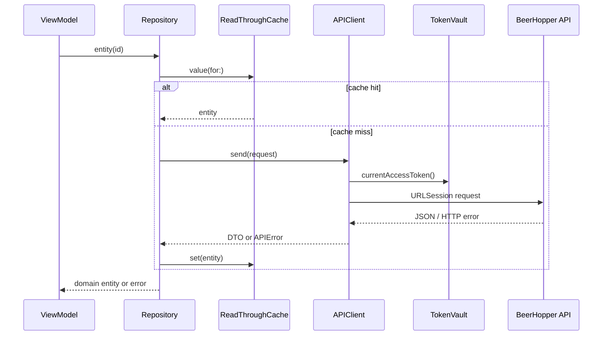
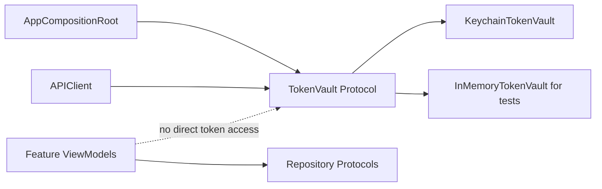

# Sprint 3 - API Data Secure

Sprint 3 adds native first-party infrastructure for API access, secure token storage, repository/cache boundaries, and feature/capability flags.

## Jira Scope

- `MOBILE-33`: Implement first-party URLSession REST client
- `MOBILE-34`: Implement API error taxonomy and decoder standards
- `MOBILE-35`: Implement Keychain token vault and secure session reset
- `MOBILE-36`: Implement repository protocols and read-cache skeleton
- `MOBILE-37`: Implement feature flag and server capability model

## Implementation Notes

- `APIClient` builds JSON requests with injected `HTTPTransport` and `AuthTokenProviding`.
- `APIError` maps transport, decoding, auth, not-found, rate-limit, and server failures.
- `BeerHopperJSON` centralizes encoder/decoder behavior for API-facing code.
- `TokenVault` defines secure session storage; `KeychainTokenVault` is the production adapter and `InMemoryTokenVault` supports previews/tests.
- `Repository`, `APIBackedRepository`, and `ReadThroughCache` define the data access and stale-read boundary for later feature work.
- `FeatureFlagStore` keeps new feature flags and server capabilities default-off unless injected.
- `AppCompositionRoot` owns the long-lived API, token vault, and feature flag dependencies without singletons.

## Request Flow



## Security Boundary



## Validation

```bash
git diff --check
swiftlint lint --config .swiftlint.yml --quiet --lenient
swift test --package-path DesignSystem
xcodebuild build -workspace BeerHopper.xcworkspace -scheme BeerHopper -destination 'generic/platform=iOS' CODE_SIGNING_ALLOWED=NO
```

GitHub PR validation also runs the iOS CI workflow.
