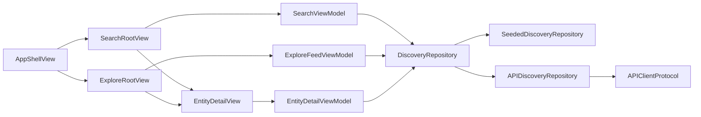

# Sprint 4 - Discovery Search

Sprint 4 adds the native discovery foundation for public read flows:

- Global search MVVM flow with query and scope state.
- Public Explore feed model and view model.
- Public entity detail shell for breweries, beers, recipes, and community posts.
- Reusable signed-out mutation prompt for save/follow/claim/manage actions.
- Injected discovery repository protocol with seeded data for previews/tests and an API-backed adapter for future endpoint activation.
- Rollout flags for the new Search and Explore surfaces; defaults remain off until validation.

## Architecture

## Runtime Rules

- Public discovery screens are read-only until an authenticated flow is available.
- Mutation affordances route through `MutationSignInPromptView`.
- Feature views receive repositories through initializer injection; no singleton access is used.
- `FeatureFlag.discoverySearch` and `FeatureFlag.publicExploreFeed` gate the new UI surfaces and default off.
- Production endpoint activation should be done by swapping the injected `DiscoveryRepository` in the composition root after API contract validation.

## Verification

- `swiftlint lint --config .swiftlint.yml --quiet --lenient`
- `swift test --package-path DesignSystem`
- `git diff --check`
- GitHub iOS CI for Xcode build/test validation
